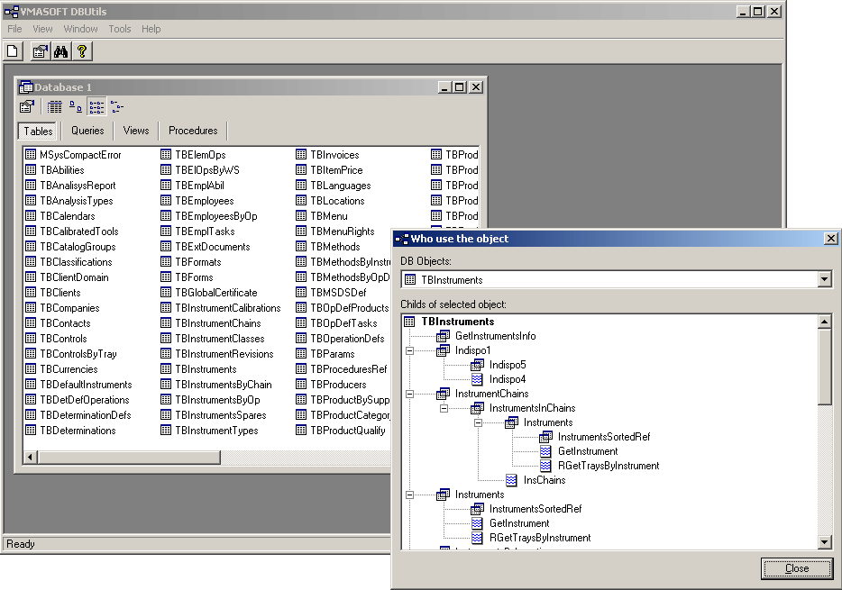

DBUtils 1.1.1
=============

Last update: 2002 - 2003

Browse and perform recursive searches in .MDB files without Microsoft Access

Access objects dependencies was one of the most wanted feature of Microsoft Access environment. Until releasing this tool developers spent hundreds of hours checking "by hand" the relations between objects in the process of maintaining or normalizing the database.

Now, with only one click, the developers can see the hierarchical dependencies for a specific query/view, viewing the entire tree of queries and tables that are used (or use) by an object. Other important features include the ability to perform searches through database structure or to view table content. This software can also be used by persons interested in opening .MDB files without having to buy the more expensive Microsoft Access application.

According to Microsoft, viewing a list of objects that use a specific object will help you maintain the database and avoid errors related to missing record sources. Using DBUtils you can always check the dependencies before deleting a database object (table, query or view) to ensure that the object is not used somewhere else in your database relations and its deletion will broke the database integrity.

Features:
---------

- View Microsoft Access database properties 
- View tables, views and queries 
- View structure of tables 
- View, using a colored syntax editor, the SQL behind views and stored procedures 
- View the data from tables and views 
- View the source code of application associated with the database 
- Perform searches in database structures and source code files 
- View object dependencies: parents and child of tables, views, stored procedures 
- Compatible with MS Access 97, 2000+ databases 
- Easy to use - GUI is similar to Microsoft Access application 

